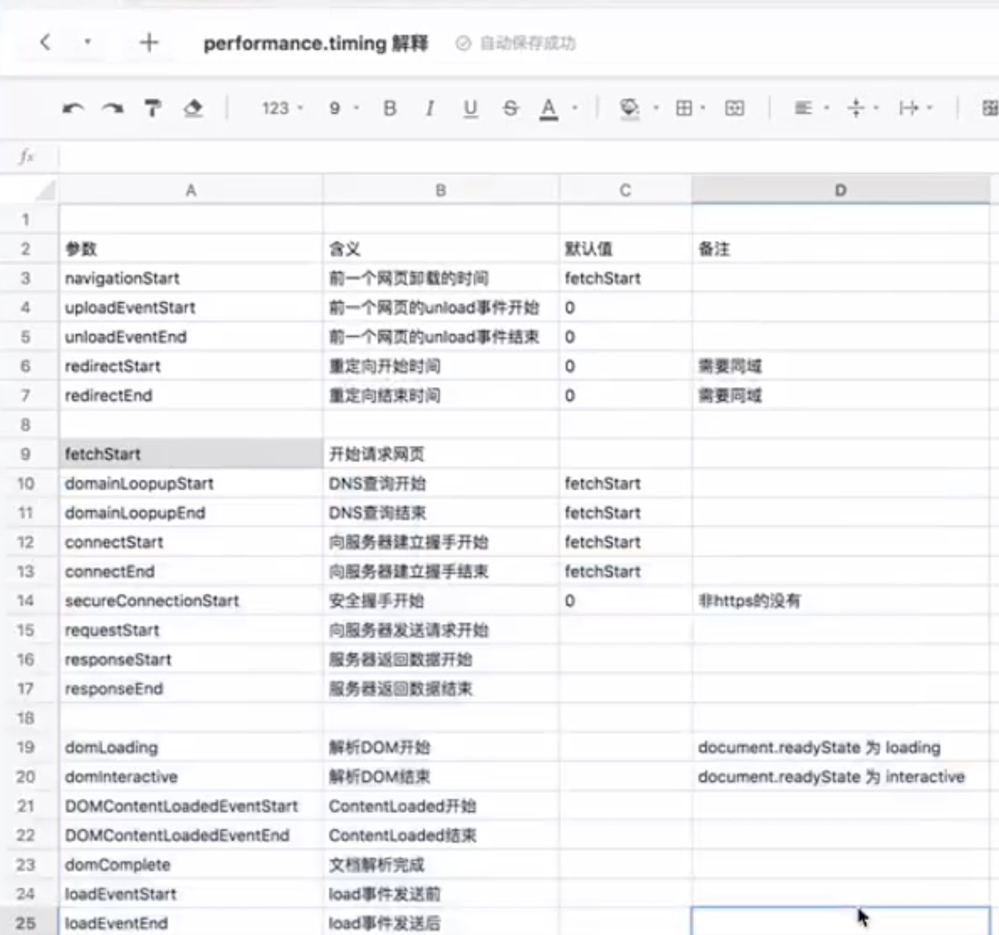

# @careteen/leesin

## 前言

前端性能监控工具

`Server`见[@careteen/leesin-server](https://github.com/careteenL/leeSin-server)

## 功能

TODO

- 技术监控层面
  - [x] 页面性能监控
  - [x] 静态资源性能
  - [x] 错误监控
  - [x] 接口性能
- 行为监控层面
  - [ ] 用户行为路径
  - [ ] 打点监控
  - [ ] 大量log上报策略
  - [ ] 时效策略
- [ ] 服务端`@careteen/leesin-server`
  - [ ] EGG全家桶
- [ ] 管理后台`@careteen/leesin-admin`
  - [ ] React全家桶

## Examples

```shell
npm i
npm run example
```
open http://localhost:15566

## 分析



